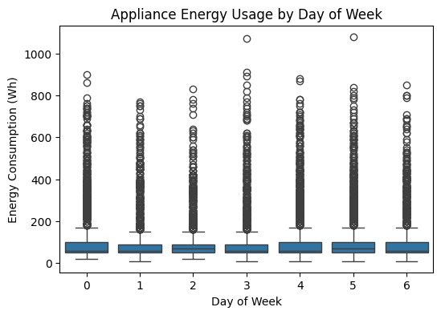
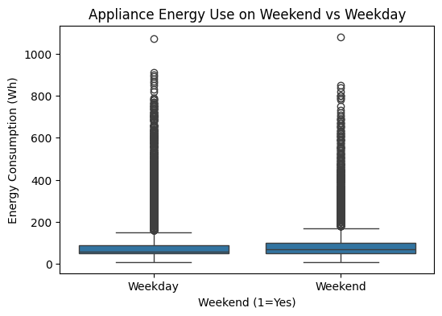
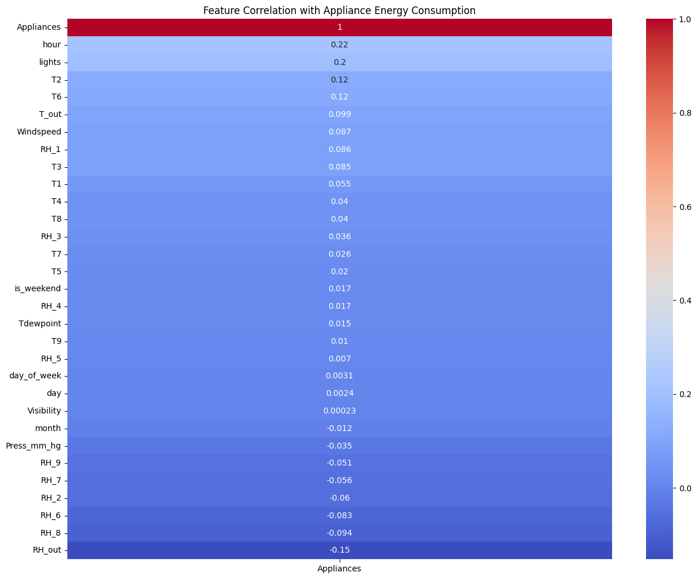
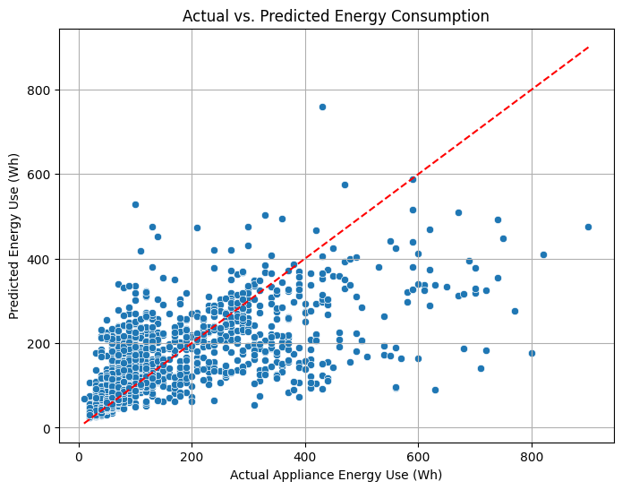
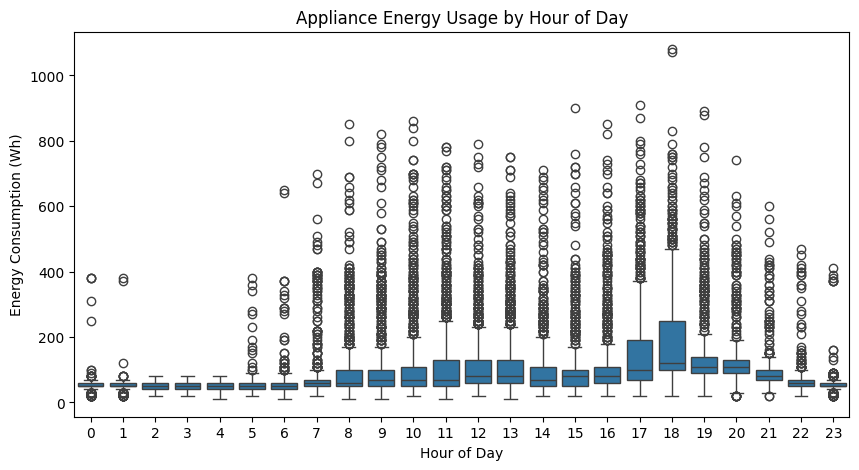
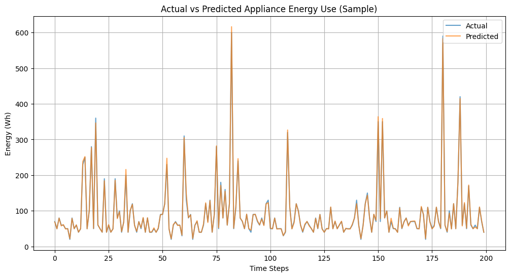
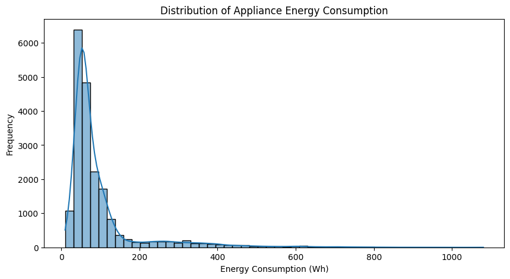
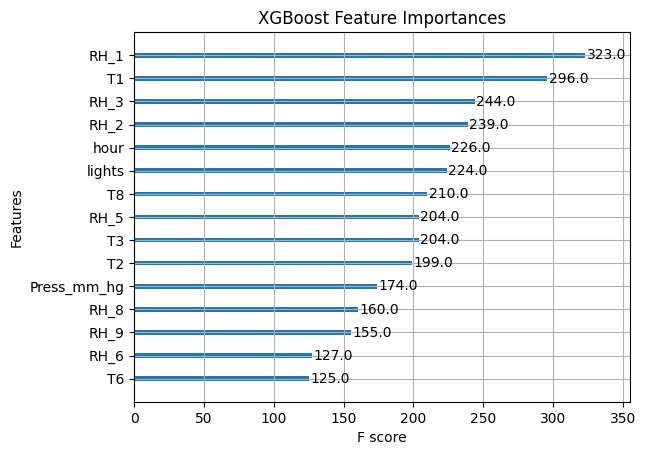
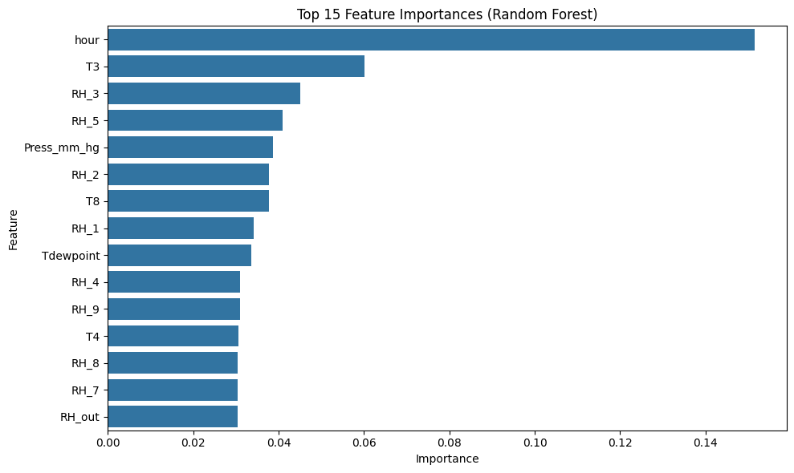

# appliance-energy-prediction
This project predicts smart home appliance energy consumption using machine learning and time-series feature engineering. Built on the [UCI Energy Dataset](https://archive.ics.uci.edu/ml/datasets/Appliances+energy+prediction), it demonstrates how lagged behavior and temporal trends can significantly boost model performance.

---

## Dataset
- **Source**: UCI Machine Learning Repository
- **Sampling**: Every 10 minutes
- **Target Variable**: `Appliances` (energy use in Wh)
- **Features**:
  - Indoor temperature and humidity from multiple rooms
  - Outdoor temperature, humidity, visibility, and pressure
  - Time-based features: hour, day of week, weekend indicator

---

## Goal
Predict appliance energy usage accurately by:
- Engineering time-aware features (lags, rolling averages)
- Training a tuned **XGBoost Regressor**
- Evaluating performance using MAE, RMSE, and R²

---

## Feature Engineering Highlights
| Feature Type        | Description                                 |
|---------------------|---------------------------------------------|
| Lag Features      | Previous appliance usage (10 min to 4 hours)  |
| Rolling Features  | Mean, std dev over 1–2 hour windows           |
| Delta Feature     | Difference from 10-minute lag                 |
| Hour Encoding     | One-hot encoded hour of day                   |

---

## Results

| Metric | Value |
|--------|-------|
| MAE    | 2.64 Wh |
| RMSE   | 7.63 Wh |
| R²     | **0.994** |

By modeling recent usage patterns and optimizing the regressor, the final model achieved near-perfect accuracy.

---

## Visualizations

### Distribution of Appliance Energy Consumption

### Appliance Energy Usage by Hour

### Energy Usage by Day of Week

### Weekend vs Weekday Usage

### Feature Importances (XGBoost)

### Feature Importances (Random Forest)

### Actual vs Predicted (Sample Line Plot)

### Actual vs Predicted Scatter

### Correlation Heatmap

